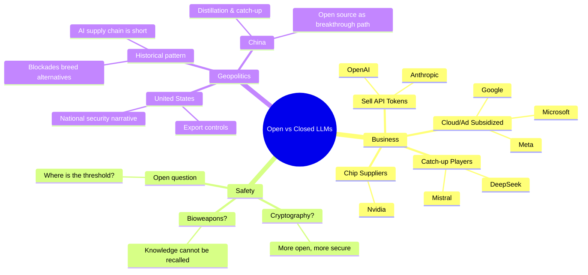
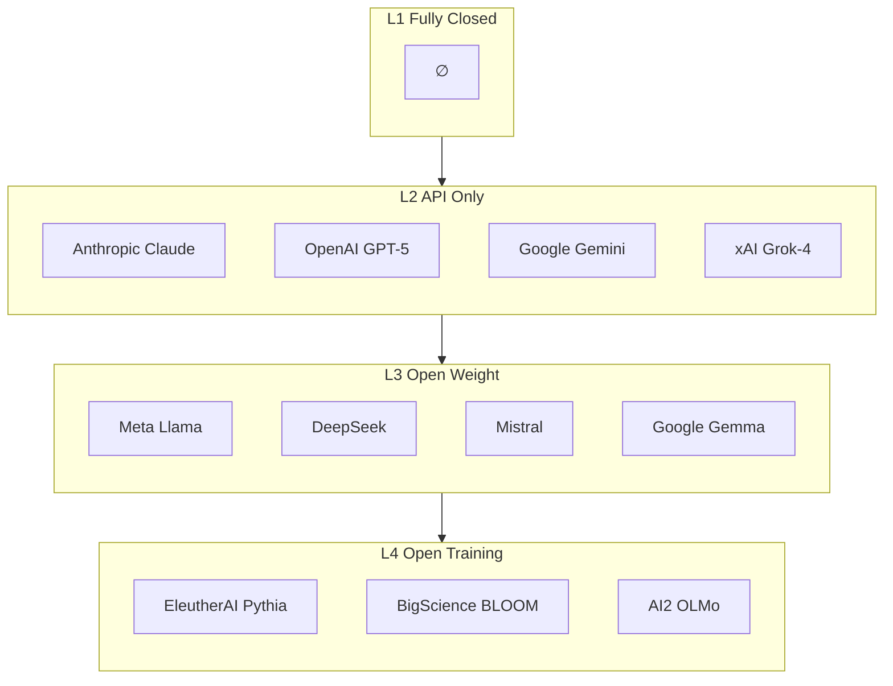
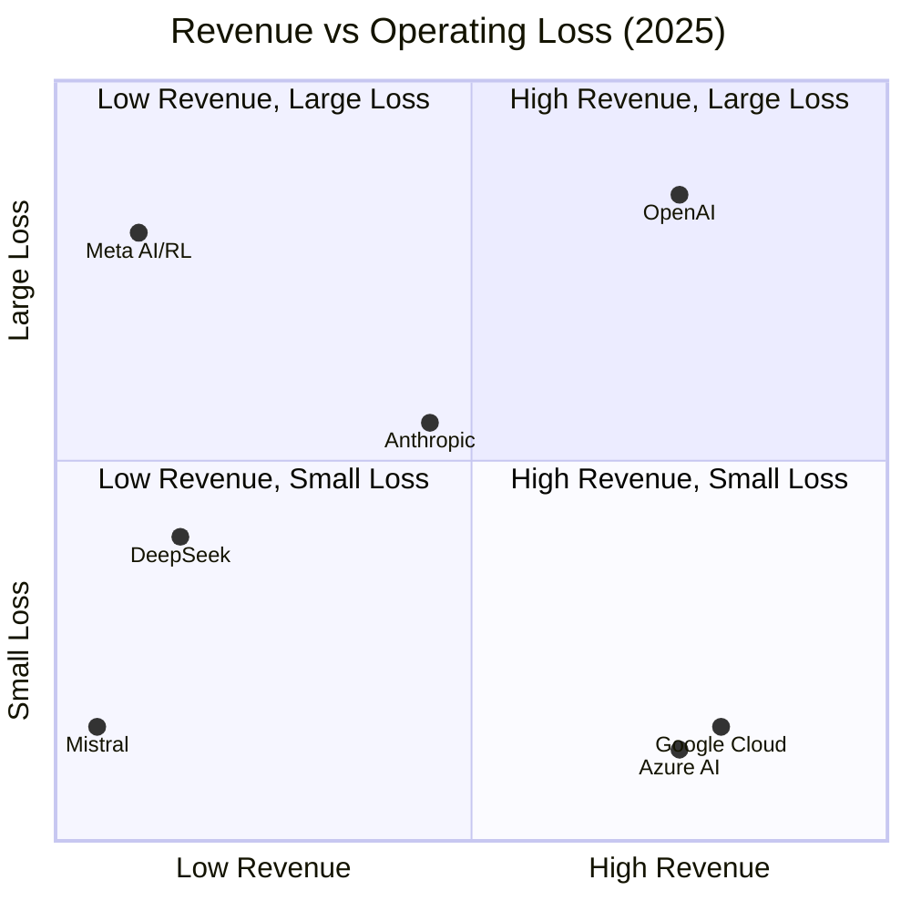
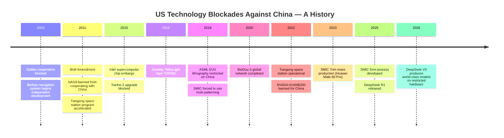

import { Aside, Badge, Ruby } from "@/components/content/components";
import { Icon } from "astro-icon/components";

export const config = {
  L1: { text: "text-red-600", bg: "bg-red-600/30", icon: "tabler:lock" },
  L2: { text: "text-orange-600", bg: "bg-orange-600/30", icon: "tabler:barrier-block" },
  L3: { text: "text-green-600", bg: "bg-green-600/30", icon: "tabler:matrix" },
  L4: { text: "text-blue-600", bg: "bg-blue-600/30", icon: "tabler:pipeline" },
};

export const L = ({ text }) => (
  
    
      <Icon
        name={config[text].icon}
        class:list={["size-4 align-parent-middle", config[text].text]}
        aria-hidden="true"
      />
      {text}
    
  
);

export const L1 = () => <L text="L1" />;
export const L2 = () => <L text="L2" />;
export const L3 = () => <L text="L3" />;
export const L4 = () => <L text="L4" />;

## Foreword

Anthropic CEO Dario Amodei says open-source models are heading down a "very dangerous path"[^dario_testimony_2023], calls open source a "red herring"[^dario_model_capability_vs_open], and urges giving governments the power to block dangerous model deployment[^dario_policy_on_ai_exponential]. Meta's chief AI scientist Yann LeCun fires back, accusing him of "regulatory capture" using safety fear[^yann_regulatory_capture]. DeepSeek trains a model rivaling GPT-5 on restricted chips and dumps the weights on the internet under MIT license. Mistral CEO Arthur Mensch says "treat intelligence like electricity" — you don't run a power grid through a single switch[^arthur_mistral_review].

Each side has a internally consistent narrative. But they are not arguing on the same plane. After untangling the threads, this debate breaks down into three independent dimensions:

- **Business**: How open you can afford to be is a function of where your revenue comes from. Companies that sell API tokens (OpenAI, Anthropic) would be committing suicide by open-sourcing weights. Ad-and-cloud-subsidized players (Meta, Google, Microsoft) can weaponize open source as an ecosystem strategy. Catch-up players (DeepSeek, Mistral) struggle to survive without it.
- **Safety**: Does openness make models safer or more dangerous? Two fundamentally incompatible assumptions are colliding. One sees AI safety like cryptography: the more open, the more scrutiny, the safer. The other sees it like bioweapons: knowledge, once released, cannot be recalled, so pre-release approval is necessary. There is currently no technical evidence to decide which analogy is correct.
- **Geopolitics**: The US wants to treat advanced AI models like a new "nuclear technology" and control exports. But history shows that in technology domains with short supply chains, blockades tend to create alternatives — often accelerating the process.

These three dimensions are tangled together, producing cross-talk at cross-purposes. Dario wraps business choices in safety language. The US wraps industrial protection in national security language. Chinese vendors wrap catch-up strategy in open-source narratives. Only by understanding who makes money how, what they fear, and what they want, can you separate signal from noise.

Below is the full picture we assembled from all verifiable public statements, financial data, and historical case studies.

---

## Open vs. Closed Source in LLMs

"Open source" for large models is not the same as open source for traditional software. So the first step is to figure out the definition.

We distinguish four levels:

- <L1 />: Fully closed. No model details published, no API offered. No commercial player occupies
  this space.
- <L2 />: API only. Accessible via API, but model weights and training details are not released.
  Anthropic Claude, OpenAI GPT-5 series, Google Gemini, xAI Grok-4 live here.
- <L3 />: Open weight. Model parameters are publicly released, typically accompanied by papers and
  technical reports. Meta Llama, DeepSeek, Mistral's core models, Google Gemma live here.
- <L4 />: Open training. The full pipeline — dataset, training code, model weights — is public. No
  commercial company operates here. The closest examples are academic projects: EleutherAI's Pythia,
  BigScience's BLOOM, AI2's OLMo.

These levels are a spectrum, not a taxonomy. In fact, **almost no company operates on a single level**; most straddle two or three. OpenAI's flagship product is <L2 />, but competitive pressure pushed them to release <L3 /> GPT-OSS in 2025 (no public plans for follow-up). Google keeps <L2 /> Gemini closed while running <L3 /> Gemma as a complementary line. Mistral's core models are <L3 /> open-weight, while enterprise customers get <L2 /> API access.

A company straddles levels not because of a philosophical stance on openness, but because of how it plans to make money.

## The Real Dividing Line: Who Sells API Tokens

When you lay out every publicly available financial statement and estimate, a clear picture emerges:

| Company          | 2025 Revenue  | 2025 Op. Loss  | Gross Margin | Business Model     |
| ---------------- | ------------- | -------------- | ------------ | ------------------ |
| **OpenAI**       | \$13.1B       | -\$20.9B       | 46%          | API + Subscription |
| **Anthropic**    | ~\$9B ARR     | -\$5B          | 40%          | API + Subscription |
| **DeepSeek**     | Not disclosed | Estimated loss | ~12%         | API (low-cost)     |
| **Mistral**      | ~\$400M ARR   | Not disclosed  | —            | API + Enterprise   |
| **Meta AI/RL**   | ~\$1B         | -\$19.2B       | —            | Ad-subsidized      |
| **Google Cloud** | \$80B+        | **Profitable** | —            | Cloud services     |
| **Azure AI**     | \$75B+        | **Profitable** | —            | Cloud services     |

Sources: [^openai_revenue] [^anthropic_revenue] [^deepseek_revenue_composition] [^meta_revenue] [^google_cloud_revenue] [^azure_revenue]

OpenAI burned \$20.9B in 2025 while earning \$13.1B — every dollar of revenue cost \$1.60[^openai_revenue]. Anthropic's annualized revenue is ~\$9B against \$5B operating losses, with gross margin at only 40% (inference cost overruns of 23%)[^anthropic_revenue]. Neither is profitable; both survive entirely on external financing. OpenAI has raised over \$160B cumulatively[^openai_funding], Anthropic over \$44B[^anthropic_funding].

Pure-play LLM startups cluster on the left and top of the chart: either low revenue or large losses. The lower-right corner belongs to Google Cloud (\$80B+) and Azure AI (\$75B+), which are profitable not because their AI models are better, but because they have other profit pillars. They sell shovels in a gold rush.

Faced with these numbers, Dario's choices become easy to understand. If Anthropic open-sourced Fable 5 or Mythos 5 tomorrow, its API revenue would almost certainly collapse. Meanwhile, training and inference costs do not disappear — the near-billion-dollar annual cluster operating bill does not get paid by someone else just because you open-sourced the weights. He calls open source "dangerous." Part of it may be genuine concern. But the more direct explanation is: **his business model left him no room to doubt.**

Now look at the other side.

Meta's Reality Labs lost \$19.2B in 2025[^meta_revenue]. But core advertising profits — \$83.3B — easily cover it. Llama is fully open not out of charity, but so that when Llama becomes the industry standard and everyone runs it on AWS, GCP, and Azure, Meta's influence expands. It doesn't make money on API tokens; it makes money on ecosystem leverage.

Similarly, Google Cloud posted \$80B+ in annual revenue[^google_cloud_revenue] and Azure AI over \$75B[^azure_revenue], both overall profitable. Google keeps Gemini closed and Gemma open. The same company plays two levels because its returns are in cloud-service tail revenue, not model revenue.

DeepSeek sits at the other extreme. V3's final training consumed ~2.66M GPU hours — 8.6% of Llama 3 405B's cost[^deepseek_v3_cost]. But training is just the tip of the iceberg. SemiAnalysis estimates their total investment: \$1.3–1.6B in hardware, \$700–900M in annual cluster operating costs[^deepseek_total_cost]. Their API pricing is 1/10 to 1/20 of US competitors, with gross margin around 12%[^deepseek_revenue_composition]. At these numbers, profitability is a luxury. DeepSeek's strategy is to use architectural efficiencies — MoE, MLA, DSA — to compress costs below what competitors can match, using a \$7.4B war chest[^deepseek_found_raising] to buy 3–5 years of runway. This is not a high-margin business; it's a price war.

Each of these three irreconcilable business interests comes with a convenient safety narrative. Dario needs people to believe open weights are dangerous, otherwise his pricing power collapses. Meta needs people to believe open source is the mainstream trend, otherwise Llama's community influence erodes. DeepSeek doesn't need to craft a safety narrative at all: its near-free pricing and open-source strategy directly undermine the "safety premium" argument. Understanding this dynamic is essential before wading into the safety debate.

## The Real Structure of the Safety Debate

When we turn to safety, things get complicated. Yes, business models determine positions. But safety concerns are not fabricated either. Some of what Dario says is true — it's just that commercial interests have amplified its importance, making truth and distortion hard to separate.

First, large models have characteristics that traditional software lacks. A traditional software vulnerability is a code bug — a patch fixes it, functionality stays, security improves. A large model's "vulnerability" is at the capability level: a model that writes convincing phishing emails isn't buggy — it's a natural consequence of understanding language and persuasion. You cannot patch away that capability without degrading its ability to help you write business emails. This is the real meaning of "irreversibility." Once weights are released, there is no way to force every user to update to a "safe version." You ship a fix; bad actors simply don't download it. What then?

The June 2026 Fable 5 incident illustrates this paradox perfectly. The US government ordered Anthropic to cut Mythos 5 access to all foreign nationals, including Anthropic's own foreign engineers[^anthropic_US_regulation]. If you side with Dario's safety argument, this is a perfect exhibit: with open weights, that control point doesn't exist — no one can unplug servers in a Chinese data center. But if you side with the openness argument, it's equally damning: Anthropic's customers lost service overnight, unable to migrate or self-heal. Centralized control can be reversed, but centralized power can be used in any direction. The same event supports both sides, which is precisely why the safety debate cannot be resolved by a single incident.

The irreversibility of large models is a warning worth taking seriously. But the other side is equally real: **attackers can always get a model.**

Every historical version of DeepSeek, Llama, and Mistral is on the internet. Even if every provider switched to strict <L2 /> tomorrow, a sufficiently motivated attacker could use these existing models to continue training, distilling, or fine-tuning what they want. The "safety" Dario wants to lock behind <L2 /> is mathematically unattainable. Any digital asset ever published on the internet cannot be fully erased. So "irreversibility" is an objective fact — but it does not automatically imply "therefore we should close everything." It only implies "pure blockade is futile."

On the other side, **the more closed, the less secure.** This is the angle Yann LeCun has been pushing since 2023[^yann_regulatory_capture].

There is no reason to assume model providers will never be compromised, never coerced by governments, and never act maliciously (actively or passively). The first principle of security engineering is that trust itself is a vulnerability — and the <L2 /> security model is built on uncritical trust in the provider. The more concentrated the supply chain, the greater the single point of failure risk. The Fable 5 incident, where <L2 /> users lost capability overnight, is a case in point. <L3 /> users never face this problem.

Different openness levels command different security tools. <L2 /> defenses stop at API guardrails (input/output filtering, prompt injection, etc.). <L3 /> can do much more: fine-tuning to adjust model behavior, circuit editing to isolate key neurons, community red-teaming at scale. <L4 /> allows inspecting training data for poisoning.

An underappreciated fact: **Dario's own safety research team — Constitutional AI, circuit tracing, sparse autoencoders — all rely on <L3 />-level tools. And those tools are themselves open source.**[^anthropic_circuit] The irony: he says "open source is unsafe" while his engineers use open-source tools to understand his own models.

Which brings us to the boundary of what we can settle, because there is a prior question that determines the direction of every argument that follows: **Does AI safety look more like cryptography, or more like bioweapons?**

This matters because these two technologies have completely opposite governance histories. In cryptography, more openness means more security. Public algorithms are scrutinized by cryptographers worldwide; weaknesses are patched. TLS, end-to-end encryption, digital signatures — none of them could be built behind closed doors. Bioweapons are the opposite: smallpox exists in only two official samples, synthetic biology protocols are tightly monitored. Some knowledge, once released, cannot be recalled.

Cryptography has a consensus known as Kerckhoffs's principle: **a secure system should not depend on attackers being unable to know its internal workings.** Security should rest on the secrecy of the key, not the secrecy of the algorithm. The mapping to large models is straightforward: your defense cannot rely on the assumption that "attackers can't get the model." Historical <L3 /> models and ongoing distillation attacks provide ample evidence.

But there is an important difference. Cryptography has mathematical foundations. RSA's security rests on the hardness of factoring; you can prove cracking it requires superpolynomial time. Large models have no such backing. You cannot mathematically prove that a model will never produce harmful output under any prompt. The model's "safety boundary" is fuzzy, empirical, and not formally verifiable. This is the weakest link in the cryptography analogy.

If AI is closer to bioweapons, we need a human-in-the-loop to control its boundary with the physical world — and we need to think about how to design and oversee that boundary.

One data point worth considering. In May 2026, Anthropic disclosed that in Claude's human-in-the-loop approval system, **93% of prompts were approved without modification**[^anthropic_HITL_vs_HOTL]. Perhaps Claude's suggestions are good enough not to need changes, but that misses the point. The purpose of safety review is to catch potentially harmful output. If 93% of reviews pass through unchanged, either the review criteria are toothless, or the model's self-restraint is already beyond the need for external oversight — and in the latter case, the review itself is redundant. Neither interpretation supports the conclusion that "our closed-loop safety mechanism works." This data point leans toward the cryptography prediction: in an open system, defenders and attackers play on the same field, and defenders cannot achieve safety through procedural secrecy alone.

So which category AI falls into determines governance direction. If the primary destructive vectors are through code and information (automated attacks, mass phishing, fraud), the cryptography analogy holds and open competition can solve them. If it involves irreversible physical harm (autonomously designing novel pathogens, attacking critical infrastructure), the bioweapon warning is real.

I don't know the answer. Frankly, nobody does right now. So back to the original question: is open safer or closed? The answer depends on when (and whether) model capabilities cross some as-yet-undefined threshold. There's one asymmetry worth noting: if the cryptography analogy is correct, a closed strategy merely delays safety progress — red teams locked inside a few companies cannot match the global community's combined red team. But if the bioweapon analogy is correct, open-sourcing the wrong model could have irreversible consequences. This asymmetry is the hardest point to refute in Dario's entire narrative — not because it's right, but because the consequences it points to are too severe to experiment with.

## Geopolitics: Who Is Using Whom?

At the national level, this looks like a US-China national security contest. But unpack it and the story is less straightforward.

Even accepting the national security framing for a moment, the available tools are limited to two categories: controlling model capability exports (including direct API access and what gets extracted via distillation) and controlling the hardware used to train AI. Let's examine each.

<Aside type="info" title="The Feasibility of Distillation on L2 Models">

Before going further, a technical clarification: **strict knowledge distillation is not feasible on <L2 /> models.** True knowledge distillation requires the student model to learn from the teacher's output probability distribution (logits). <L2 /> models release neither weights nor logits. Users only get text outputs from the API, which have already been sampled and post-processed, losing the full probability distribution. The reasoning trajectory is typically repackaged by a summarization model, not the raw chain of thought. So in principle, "distilling" an <L2 /> model via API calls cannot reproduce its original capabilities.

What the industry calls "distillation from large models" actually refers to using the model's output trace (tool call paths, reasoning chains) as reinforcement learning signals — essentially imitation learning, quite different from traditional knowledge distillation. For convenience, we still use the term "distillation," but it's important to understand it does not refer to logits-level knowledge distillation in the traditional sense.

</Aside>

In February 2026, Anthropic published a blog post accusing DeepSeek, Moonshot (Kimi), and MiniMax of carrying out distillation attacks involving 16 million exchanges with Claude through 24,000 fraudulent accounts[^anthropic_prevent_distillation]. DeepSeek was specifically accused of 150,000 exchanges targeting reasoning capability extraction, including using Claude as a reward model. OpenAI had found similar evidence as early as January 2025 and blocked DeepSeek's API access[^openai_anti_distillation]. Large-scale, systematic distillation activity is real.

But the question is: what role does distillation play in the US-China AI competition? My assessment: **distillation is not the foundation of Chinese model capabilities; it's a high-ROI method to accelerate research and improve quality.**

Two reasons. First, the linguistic structure, world knowledge, and logical relationships learned during pre-training cannot be acquired from output distributions through distillation. DeepSeek V3's technical report explicitly states that pre-training used only web and ebook data, no synthetic data[^deepseek_v3_r1_report]. Second, if distillation were foundational, cutting API access should effectively halt Chinese model progress. Yet after OpenAI blocked DeepSeek in January 2025, DeepSeek did not stop improving — it pushed its model capabilities to near GPT-5 levels in the following months. The DeepSeek R1 paper[^deepseek_v3_r1_report] describes the actual training pipeline: R1-Zero is trained through pure reinforcement learning (GRPO), improving AIME 2024 from 15.6% to 71.0% with no supervised data or distillation whatsoever. Distillation only appears in the final step, transferring the trained R1's capabilities to smaller models (Qwen/Llama base) for open-source release. This is a "we developed it, then we distill it out" pipeline, not a "we distill from others" pipeline. The claim that Chinese model companies catch up by distilling American models is fundamentally unsupported. Distillation has a role, but that role has been exaggerated.

The numbers from Anthropic's accusation also support this. 150,000 API calls cost about \$20,000 — in a \$1.6B total investment project, that's not a shortcut, it's experimental iteration acceleration. What determines capability is not \$20,000 worth of trajectory data, but \$1.6B in hardware infrastructure and architectural innovation (MoE, MLA, GRPO, etc.).

More importantly, **mutual distillation is an open secret in model development.** Chinese model vendors often see access surges after releasing new models and are forced to impose rate limits — this has become a standard strategy for open-weight vendors. They learn from each other to avoid major training biases while also contributing their own outputs to the community. This is not unique to Chinese vendors. In fact, Anthropic's own published models have hallucinated about their identity, claiming to be other models rather than Claude[^model_hallucination]. This strongly suggests that training data was contaminated with outputs from other models — either through intentional distillation or incomplete data cleaning. Such signs are not isolated incidents, raising reasonable doubt that cleaning out other models' influence from training data is far harder than publicly claimed.

With this lens, re-examine the "distillation threat": if mutual distillation is industry practice, what is the point of anti-distillation measures (monitoring anomalous API patterns, mass-banning fraudulent accounts) targeted at Chinese vendors? They raise the cost of obtaining high-quality alignment data — from "essentially free and unlimited" to "needs to evade detection, maintain many accounts, risk discovery." This may slow down catch-up, but the marginal effect is diminishing, and it cannot fundamentally stop it. The core variable in US-China AI competition is not distillation offense and defense; it's hardware supply and architectural innovation speed — which is precisely what the second control measure targets.

So we have to ask: **what can export controls actually achieve?** Over two decades of US technology blockades against China provide a natural quasi-experiment.

In 2015, the US government blocked Intel from exporting Xeon coprocessors to Tianhe-2, citing use for simulated nuclear explosions. **14 months later**, Sunway TaihuLight topped the TOP500 with fully indigenous SW processors. It didn't nearly catch up — it tripled performance[^sunway_taihu_light].

In 2003, the US pressured Europe to exclude China from the core decision-making body of the Galileo satellite navigation system. **17 years later**, BeiDou-3 achieved global coverage. In 2023, the US government's PNT Advisory Board warned that GPS had substantively fallen behind BeiDou in capability[^GPS_vs_BDS].

In 2011, Congress passed the Wolf Amendment, banning NASA from any bilateral cooperation with China. **11 years later**, the Tiangong space station was completed in orbit. The ISS is scheduled for decommission around 2031, at which point Tiangong may be the only long-term crewed space station in orbit[^ISS_vs_CSS].

Advanced semiconductor manufacturing is the only case where China has not fully broken through. Since 2018, the Netherlands, under US pressure, has progressively tightened ASML lithography exports, with EUV completely embargoed. SMIC achieved 7nm (2023) mass production and 5nm (2025) process development without EUV[^nvidia_vs_huawei]. The gap is roughly 4–5 years and has remained essentially unchanged since 2018. The blockade hasn't closed the gap, but it hasn't widened it either.

There is a key difference between semiconductors and AI chips. Semiconductor supply chains are deep: EDA software, lithography, high-purity chemicals, specialty gases, advanced packaging, testing — each link requires decades of accumulated expertise and patent barriers. AI chip supply chains are much shorter. GPUs are fungible commodities, accessible through informal channels (multiple large-scale chip smuggling rings were broken up in 2025)[^nvidia_vs_huawei], cloud services can be rented cross-border, and a significant portion of competitiveness is in software and architecture, which don't depend on chip process technology.

Epoch AI's assessment of the US-China hardware gap confirms this: roughly 4 years behind in training, **effectively zero gap in inference**[^us_export_control_china_ai]. The H20 delivers only 15% of H200's FP8 compute, but memory bandwidth is close (~83%), meaning inference service quality is roughly comparable — the constraint is primarily on training speed.

For **Nvidia**, this is also a practical factor behind its opposition to full export controls. Almost every company buys its GPUs; the hotter the AI arms race, the more it sells. Export controls are a double-edged sword: compliance buys political capital in Washington, but losing the China market pushes long-term demand toward Huawei's Ascend. Nvidia's optimal position is limited cooperation with US controls while never proactively tightening — the H20 is a product of this calculus[^nvidia_H20_vs_H200].

When we unpack to this point, the "open-source AI threatens national security" narrative reveals a three-layer structure:

1. **Real**: Frontier model capability irreversibility does introduce new risks. If the next generation of an open-weight model acquires autonomous cyberattack capability, with no warning and no patch, it lives on the internet forever. This is Dario's core point, and it is technically valid.
2. **Conflated**: "Chinese models are catching up" is equated to "Chinese threat." In reality, economic competition and security threats are completely different things. No publicly attributed evidence exists that Chinese models have been used in attack operations against US infrastructure.
3. **Backfiring**: Export controls have created what they sought to prevent. Without H800 bandwidth restrictions, DeepSeek might never have invested so heavily in software optimization. As the CFR report honestly summarizes: controls did not prevent catch-up — they changed its mode, from buying better chips to writing better algorithms on the chips available[^nvidia_vs_huawei].

Beyond the national security discussion, there is an overlooked fact: **we have direct evidence that both Anthropic and OpenAI use important innovations from the <L3 /> community**, and logically other <L2 /> companies can hardly be exceptions. GPT-4 is observed by the community to use a MoE architecture — a technique first proposed by Google in a 2017 open-source paper[^moe_paper]. The sparse autoencoder method Anthropic uses in circuit tracing was first proposed by OpenAI in a 2023 open-source paper and subsequently improved at scale by the open-source community[^sae_paper]. Claude's reasoning chain optimization draws heavily on publicly available Chain-of-Thought research from the community.

Why do few <L2 /> companies publicly acknowledge this? It's not a moral failing; it's business logic. If Dario stood up and said "Claude's architectural innovations come mostly from open-source contributions," the market would naturally ask: for the same architecture, DeepSeek charges \$0.28/M tokens — why should I pay you \$15? What does the price difference buy? The answer — brand trust and enterprise compliance — is a real moat, but far less sexy than "we have the best technology." So <L2 /> companies must maintain a narrative: open weights are dangerous, immature, and behind closed-source capabilities. This narrative is the foundation of their pricing power. Export controls focus on the flow "China benefits from the US," while <L2 /> reliance on <L3 /> represents the reverse flow — "US closed-source vendors benefit from the global open-source community." Both are real interest lines on the geopolitical chessboard, but the latter is entirely obscured by the former.

The most honest summary: there is a potential irreversible risk in the near term (2–4 years), but its severity is exaggerated by <L2 /> vendors protecting their commercial interests. Export controls are not an effective response either — among the main historical cases (satellite navigation, space station, supercomputers, semiconductors, AI chips), three ended in full breakthroughs, one remains a stalemate with no widening gap, and one is still underway.

## Unknowable Futures

At this point, it's necessary to honestly list what cannot be settled. These are not flaws in the analysis — they are the boundaries of the problem.

**First, cryptography or bioweapons?** The answer determines whether "open is safer" or "closed is safer," but we cannot answer it. Current technical evidence is insufficient to categorize AI safety problems into either analogy. This uncertainty means every assertion of "open is always safe" or "closed is always safe" rests on an unverified analogy. The cryptography analogy has strong support from Kerckhoffs's principle but lacks mathematical foundations. The bioweapon fear is real, but evidence that AI has reached that threat level is absent.

**Second, can the community blue team mature?** Traditional open-source security relies on "more transparency → more auditors → faster vulnerability discovery → faster patching." This chain has an unresolved gap for <L3 /> models: traditional software audits examine a few thousand lines of code that humans can reason through line by line. Model weights are hundreds of billions of floating-point numbers — no one can read those numbers and conclude "there's a safety vulnerability here." The transparency of <L3 /> yields not code review, but community-conducted adversarial testing. Both are security contributions, but the former finds logic errors while the latter only finds behavioral deviations. How large this difference is remains to be seen.

**Third, how can human-in-the-loop be made genuinely effective?** Anthropic's 93% approval rate shows that procedural mandates alone are insufficient. A "all requests must be approved" rule is being circumvented formally 93% of the time. What incentives (economic accountability, approval caps, fail-safe mechanisms) can make human-in-the-loop more than a rubber stamp? The answer differs for <L2 /> and <L3 />: <L2 /> depends on provider-side changes, while <L3 /> allows deployers to customize approval logic per scenario.

**Fourth, where is the Chinese model data flywheel?** DeepSeek has 143M MAU in China; Qwen has 73.5M DAU. These scales are theoretically sufficient to drive an RLHF iteration loop[^deepseek_mau]. But no Chinese company has publicly described a "user feedback → model improvement" closed loop. This opacity determines the long-term effect of any blockade: if the data flywheel is already running independently, hardware disadvantages are just a speed issue; if not yet established, blockades can cut off iteration capability at the source.

These four questions point to four different uncertainty dimensions: analogy choice, community capability, institutional design, and data independence. Until they are answered, any assertion of "open always wins" or "closed always wins" depends on an unverified premise.

## Conclusion

Two kinds of voices populate this debate. One speaks from a business model, packaging commercial choices in safety language. The other genuinely cares about safety, but is drowned out by the noise of the first.

We do not have a simple answer. But we can offer a starting point for thinking: **the choice between open and closed source for large models is first a business question, second a safety question, and only last a geopolitical question.** Any argument that reverses this priority is worth asking: are you saying this because your business model (only) allows you to say this?

The answer to that question may explain more than any technical argument about which side you choose to believe.

---

## References

[^dario_testimony_2023]: Dario Amodei, Senate Judiciary Committee written testimony, July 2023. https://www.judiciary.senate.gov/imo/media/doc/2023-07-26_-_testimony_-_amodei.pdf

[^dario_model_capability_vs_open]: Big Technology Podcast interview, July 2025. "When I see a new model come out I don't care whether it's open source or not." https://www.youtube.com/watch?v=mYDSSRS-B5U

[^dario_policy_on_ai_exponential]: Dario Amodei, "Policy on the AI Exponential," June 2026. "Their release should be blocked or reversed as a threat to public safety." https://darioamodei.com/post/policy-on-the-ai-exponential

[^yann_regulatory_capture]: Yann LeCun, X post, November 2023. "The inevitable effect, intentional or not, if governments believe those claims would be a regulatory capture profiting their companies." https://x.com/ylecun/status/1719817019858493815

[^arthur_mistral_review]: Arthur Mensch's open-source positions compiled. https://sacra.com/c/mistral

[^openai_revenue]: Fortune leaked OpenAI 2025 financials, June 16, 2026. https://fortune.com/2026/06/16/openai-financials-leaked-losses-revenue-profit

[^anthropic_revenue]: Anthropic financials: LA Times https://www.latimes.com/business/story/2026-01-23/from-4-billion-to-9-billion-anthropics-revenue-doubles-in-six-months ; Gennaro Cuofano analysis https://www.linkedin.com/posts/gennarocuofano_anthropic-lowers-gross-margin-projection-activity-7419976159246979072-AEZp

[^meta_revenue]: Meta Reality Labs 2025 operating loss \$19.2B. https://gamesbeat.com/meta-reports-19-2-billion-in-losses-for-its-reality-labs-metaverse-division-in-2025

[^google_cloud_revenue]: Alphabet FY2025 Q4 earnings: Google Cloud quarterly revenue \$20B. https://fortune.com/2026/04/29/google-earnings-cloud-ai

[^azure_revenue]: Microsoft FY2025 earnings: Azure annual revenue over \$75B. https://www.geekwire.com/2025/microsoft-posts-strong-quarter-cites-broad-ai-and-cloud-growth-as-azure-revenue-tops-75b-annually

[^openai_funding]: OpenAI cumulative funding: \$40B (Softbank, 2025) + Series G \$122B (2026). https://www.cnbc.com/2025/03/31/openai-closes-40-billion-in-funding-the-largest-private-fundraise-in-history-softbank-chatgpt.html

[^anthropic_funding]: Anthropic cumulative funding ~\$44B, including 2026 Series G \$30B. https://shanakaanslemperera.substack.com/p/the-growth-miracle-and-the-six-fractures

[^deepseek_v3_cost]: DeepSeek V3 training GPU hour comparison. https://www.interconnects.ai/p/deepseek-v3-and-the-actual-cost-of

[^deepseek_total_cost]: SemiAnalysis: DeepSeek hardware CapEx estimates. https://newsletter.semianalysis.com/p/deepseek-debates

[^deepseek_revenue_composition]: DeepSeek revenue composition estimates. https://github.com/deepseek-ai/DeepSeek-V3/issues/1364

[^deepseek_found_raising]: DeepSeek maiden fundraising \$7.4B. Reuters, June 3, 2026. https://www.reuters.com/business/retail-consumer/deepseek-slated-draw-7-billion-maiden-fundraising-sources-say-2026-06-03

[^deepseek_mau]: DeepSeek China MAU data. Wired https://www.businessofapps.com/data/deepseek-statistics ; Qwen DAU data. Yicai https://www.facebook.com/yicaiglobal/posts/qwens-daily-active-users-exceeded-735-million

[^nvidia_H20_vs_H200]: Nvidia H20 FP8 compute only 15% of H200. MUFG comparison table. https://www.mufgamericas.com/sites/default/files/document/2025-12/AI_Chart_Weekly_12_12_Chip_Wars.pdf

[^anthropic_US_regulation]: Fable 5/Mythos 5 suspended by US government. CNBC, June 17, 2026. https://www.cnbc.com/2026/06/17/anthropic-ai-regulation-trump.html

[^anthropic_HITL_vs_HOTL]: Anthropic, "How We Contain Claude Across Products," May 2026. https://www.anthropic.com/engineering/how-we-contain-claude

[^anthropic_circuit]: Anthropic open-sourcing circuit tracing tools. https://www.anthropic.com/research/open-source-circuit-tracing

[^anthropic_prevent_distillation]: Anthropic, "Detecting and preventing distillation attacks," Feb 23, 2026. https://www.anthropic.com/news/detecting-and-preventing-distillation-attacks

[^openai_anti_distillation]: New York Times, Jan 29, 2025. https://www.nytimes.com/2025/01/29/technology/openai-deepseek-data-harvest.html

[^deepseek_v3_r1_report]: DeepSeek-V3 technical report (arXiv:2412.19437) and DeepSeek-R1 technical report (arXiv:2501.12948). https://arxiv.org/html/2412.19437v1

[^sunway_taihu_light]: Sunway TaihuLight tops TOP500, 2016. Wikipedia. https://en.wikipedia.org/wiki/Sunway_TaihuLight

[^GPS_vs_BDS]: US PNTAB warns GPS falling behind BeiDou, 2023. SpaceNews. https://spacenews.com/pnt-advisory-board-warns-gps-is-falling-behind-bds/

[^ISS_vs_CSS]: Tiangong space station completed 2022. https://www.space.com/china-space-station-tiangong-complete-construction

[^nvidia_vs_huawei]: CFR report, Dec 2025. https://www.cfr.org/articles/chinas-ai-chip-deficit-why-huawei-cant-catch-nvidia-and-us-export-controls-should-remain

[^us_export_control_china_ai]: Epoch AI, Dec 2024. https://epoch.ai/gradient-updates/us-export-controls-china-ai

[^moe_paper]: Shazeer et al., "Outrageously Large Neural Networks: The Sparsely-Gated Mixture-of-Experts Layer" (2017). https://arxiv.org/abs/1701.06538

[^sae_paper]: Bricken et al., "Towards Monosemanticity: Decomposing Language Models With Dictionary Learning" (Anthropic, 2023). https://transformer-circuits.pub/2023/monosemantic-features

[^model_hallucination]: Model identity confusion is a widely observed phenomenon. Because models read large amounts of descriptions about other models in training data (e.g., internet text about "GPT-4"), they may produce statistically-pattern-matched errors when asked "who are you." For related cases see Chatbox Guide's model identity test (https://chatboxai.app/en/guide/faq/model-identity) and community reports of Claude identifying as Perplexity AI (https://medium.com/@mubashir_rahim/when-ai-forgets-who-it-is-my-claude-had-an-identity-crisis-and-calling-itself-perplexity-ai-e2fe97cd0dab).
