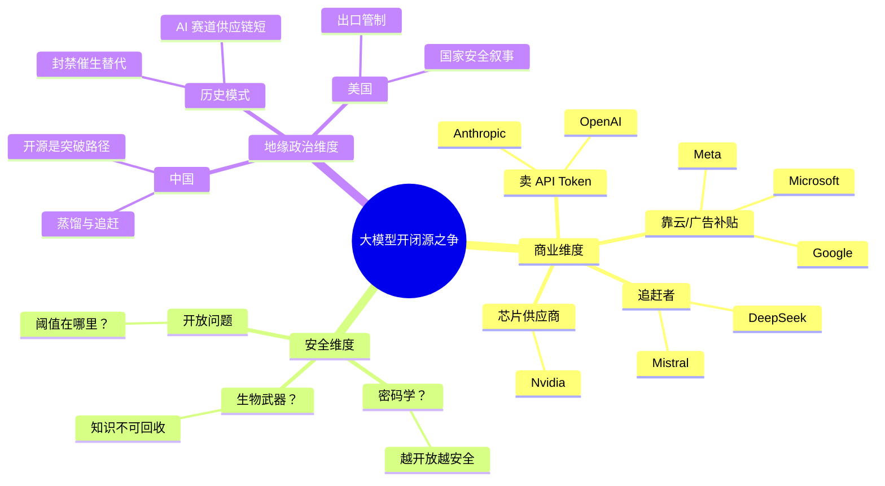
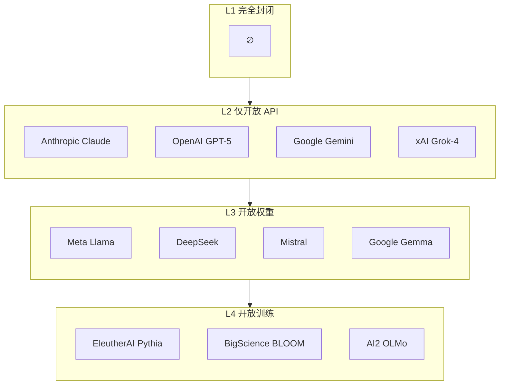
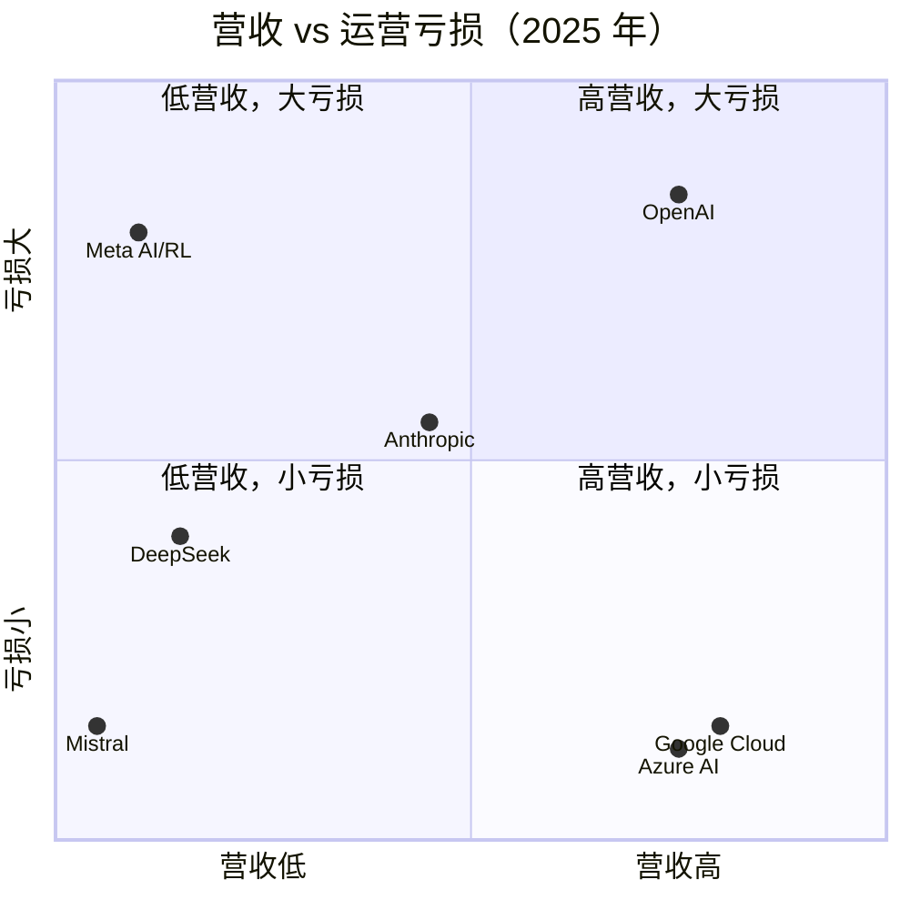
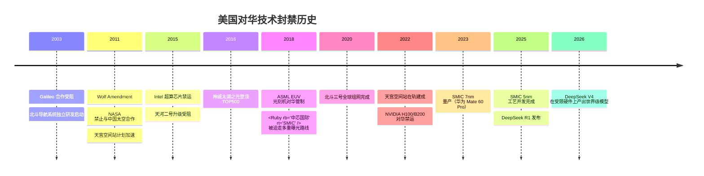

import { Aside, Badge, Ruby } from "@/components/content/components";
import { Icon } from "astro-icon/components";

export const config = {
    L1: { text: "text-red-600", bg: "bg-red-600/30", icon: "tabler:lock" },
    L2: { text: "text-orange-600", bg: "bg-orange-600/30", icon: "tabler:barrier-block" },
    L3: { text: "text-green-600", bg: "bg-green-600/30", icon: "tabler:matrix" },
    L4: { text: "text-blue-600", bg: "bg-blue-600/30", icon: "tabler:pipeline" },
};

export const L = ({ text }) => (
    
        
            <Icon name={config[text].icon} class:list={["size-4 align-parent-middle", config[text].text]} aria-hidden="true" />
            {text}
        
    
);

export const L1 = () => <L text="L1" />;
export const L2 = () => <L text="L2" />;
export const L3 = () => <L text="L3" />;
export const L4 = () => <L text="L4" />;

## 写在前面

Anthropic CEO Dario Amodei 说开源模型正在走向"非常危险的道路"[^dario_testimony_2023]，开源是个"红鲱鱼"[^dario_model_capability_vs_open]，呼吁赋予政府阻止危险模型部署的权力[^dario_policy_on_ai_exponential]。Meta 首席 AI 科学家 Yann LeCun 反过来指控他利用安全恐惧进行"监管俘获"[^yann_regulatory_capture]。DeepSeek 在受限的芯片上训练出接近 GPT-5 水平的模型，然后把权重用 MIT 协议扔到网上。Mistral 的 CEO Arthur Mensch 说"把智能当电力"，供电不能只靠一个开关[^arthur_mistral_review]。

每一方都有一套自洽的叙事。但各方不在同一维度上争论。梳理后不难发现，这场争论涉及三个独立的维度：

- **商业维度**：你的核心收入来源决定了你能承受多大的开放。卖 API Token 的公司（OpenAI、Anthropic）开放权重等于自杀。靠广告和云的（Meta、Google、Microsoft）可以拿开源当生态战略武器。追赶阶段的（DeepSeek、Mistral）不开源就很难活。
- **安全维度**：开放到底让模型更安全还是更危险？两种根本冲突的底层假设在碰撞。一种认为 AI 安全像密码学：越开放攻防越充分，整体越安全。另一种认为像生物武器：知识一旦扩散就无法回收，发布前必须审批。目前没有技术证据能决定哪个类比正确。
- **地缘政治维度**：美国想把先进模型当作新的"核技术"来控制出口。但历史反复表明，产业链短的科技领域，封锁只会逼出替代方案，往往还加速了这个过程。

这三个维度的争论被搅在一起，导致各方鸡同鸭讲。Dario 用安全术语包装商业选择。美国用国家安全术语包装产业保护。中国厂商用开源叙事包装追赶策略。只有搞清楚说话的人赚什么钱、怕什么、想要什么，才能由表及里、去伪存真。

以下是我们追踪所有可考究的公开表态、财务数据和历史案例后得出的全景图。

---

## 大模型的开源与闭源

大模型的"开源"和传统软件的开源不是一回事。需要先定义清楚。

我们区分了四个层级：

- <L1 />：完全封闭。不公开模型细节，不提供 API。没有商业化玩家在此。
- <L2 />：开放 API。可通过 API 调用，但不公布模型参数和训练细节。Anthropic Claude、OpenAI GPT-5 系列、Google Gemini、xAI Grok-4 在此。
- <L3 />：<Ruby rb="开放||权重" rt="Open|-|weight" />。公开发布模型参数，通常附有论文和技术报告。Meta Llama 系列、DeepSeek、Mistral 核心模型、Google Gemma 在此。
- <L4 />：开放训练。公开发布数据集、训练管线、模型权重全过程。商业公司无一在此。最接近的是学术界项目，EleutherAI 的 Pythia、BigScience 的 BLOOM、AI2 的 OLMo。

以上划分只是为了区分不同程度的"开源"，而不是单一的分类。事实上，**几乎没有一家公司只落在单一层级**，它们都在两到三个层级上同时活动。比如 OpenAI 主力产品属于 <L2 />，但 2025 年被竞争压力逼迫搞了一个 <L3 /> GPT-OSS（暂时没有后续开源计划）。Google 闭源 <L2 /> Gemini，同时运营 <L3 /> Gemma 作为辅助产品线。Mistral 核心模型开放权重 <L3 />，而企业版只能 <L2 /> API。

需要注意的是，跨层策略不是取决于"这家公司开不开放"，而是"它打算怎么赚钱"。一个公司的策略是商业模式和竞争压力的多因素结果。

## 真正的分界线：谁靠 API 赚钱

当我们把所有公开财务报表和估测放到一起，就会呈现出一个清晰的格局：

| 公司             | 2025 营收  | 2025 运营亏损 | 毛利率 | 商业模式         |
| ---------------- | ---------- | ------------- | ------ | ---------------- |
| **OpenAI**       | 131 亿     | -209 亿       | 46%    | API + 订阅       |
| **Anthropic**    | ~90 亿 ARR | -50 亿        | 40%    | API + 订阅       |
| **DeepSeek**     | 未公开     | 推测亏损      | ~12%   | API（低价）      |
| **Mistral**      | ~4 亿 ARR  | 未公开        | —      | API + 企业私有化 |
| **Meta AI/RL**   | ~10 亿     | -192 亿       | —      | 广告补贴         |
| **Google Cloud** | 800+ 亿    | **盈利**      | —      | 云服务           |
| **Azure AI**     | 750+ 亿    | **盈利**      | —      | 云服务           |

数据来源：[^openai_revenue] [^anthropic_revenue] [^deepseek_revenue_composition] [^meta_revenue] [^google_cloud_revenue] [^azure_revenue]

OpenAI 2025 年烧掉了 209 亿美元，赚了 131 亿，每挣 1 块钱要烧 1.6 块[^openai_revenue]。Anthropic 年化营收约 90 亿，运营亏损 50 亿，毛利率只有 40%（推理成本超预期 23%）[^anthropic_revenue]。两家都没有盈利预期，全依赖外部融资续命。OpenAI 累计融资超过 1600 亿[^openai_funding]，Anthropic 超过 440 亿[^anthropic_funding]。

纯 LLM 创业公司全部集中在左侧和上侧，要么营收低、要么亏损大。右下角的 Google Cloud（800+ 亿）和 Azure AI（750+ 亿）整体盈利，不是因为它们的 AI 模型更好，是因为它们有其他利润支柱。它们在淘金热中卖铲子。因此，面对这些数字时，Dario 的选择不难理解。如果 Anthropic 明天开放 Fable 5 或 Mythos 5 的权重，它的 API 业务营收极大概率暴跌。但同时，训练和推理成本不会消失，集群每年近 10 亿美元的运营费不会因为你开源了就有人替你付。他说开源"危险"。可能有一部分是真诚的担忧，但更直接的解释是：**他的商业模式没有给他留下质疑的空间。**

现在看另一边。

Meta 的 Reality Labs 2025 年亏了 192 亿[^meta_revenue]，但如果看 Meta 的核心业务，广告利润 833 亿，足够覆盖这个成本。Llama 全面开源不是为了慈善，而是当 Llama 成为行业标准，所有人都能在 AWS、GCP、Azure 上跑 Llama 时，Meta 的影响力随之扩大。它赚的不是 API token 的钱，是生态的钱。

同理，Google Cloud 全年营收超过 800 亿[^google_cloud_revenue]，Azure AI 超过 750 亿[^azure_revenue]，两家都整体盈利。而同时 Google 的 Gemini 闭源、Gemma 开源。同一家公司可以同时玩两个层级，因为它的收益不在模型收入上，在云服务的长尾里。

DeepSeek 在另一个极端。V3 的最终训练只用了约 266 万 GPU 时，是 Llama 3 405B 的 8.6%[^deepseek_v3_cost]。但训练只是冰山的尖。SemiAnalysis 估算了它们的总投资：服务器硬件约 13 到 16 亿美元，集群年运营成本约 7 到 9 亿[^deepseek_total_cost]。它们的 API 定价约为美国对手的十分之一到二十分之一，毛利率大约 12%[^deepseek_revenue_composition]。在这个数字下谈盈利是奢侈的。因此，DeepSeek 的策略更像是在一个时间窗口内，靠 MoE、MLA、DSA 等架构效率，把成本压到对手无法跟进，用 74 亿融资买 3 到 5 年的弹药[^deepseek_found_raising]。这不是高利润生意，是价格战。

这三种无法调和的商业利益，每一种都对应了一套方便的安全叙事。Dario 需要让人们相信开放权重是危险的，否则他的定价权无法维持。Meta 需要让人们相信开源是生态的主流趋势，否则 Llama 的社区影响力会萎缩。DeepSeek 不需要塑造安全叙事：它用低到几乎免费的价格和开源策略直接瓦解"安全溢价"的逻辑。看懂了这一点，再进入安全辩论时就不会被表象迷惑。

## 安全辩论的真正结构

而当我们把视角转向安全，事情就变得复杂了。固然，商业模式决定了立场，但安全问题也不是纯虚构的。Dario 说的某些东西是真的，只是在商业利益放大了它们的重要性之后，真假难以分辨。

首先，大模型确实有传统软件不具备的特性。传统软件的漏洞是代码写错了，后续补丁可以修复漏洞，功能不变，安全提升。大模型的"漏洞"是能力层面的：一个模型能写逼真的钓鱼邮件，不是漏洞，是它理解语言和说服技巧的自然结果。你不可能用简单的补丁去掉这个能力而不损害它帮你写商务邮件的质量。这就是他说的"不可逆"的根本含义。权重一旦发布，没有任何办法强制所有用户更新到"安全的版本"。你尝试修补发布新权重，恶意用户不下载，你能怎么办？

2026 年 6 月的 Fable 5 事件最能体现这个矛盾的两面性。美国政府下令 Anthropic 切断 Mythos 5 对所有外国国民的访问，包括 Anthropic 内部的外籍工程师[^anthropic_US_regulation]。如果你支持 Dario 的安全论，这是一个完美的例证：开放权重下这个控制点不存在，中国机房里的服务器上没有人能拔电源。但如果你支持开放论，这也是一个完美的例证：Anthropic 的客户一夜之间失去服务能力，无法迁移，无法自愈。集中控制可以逆转，但集中的权力可以被用在任何方向。同一事件同时支持了双方的论点，这也正是安全辩论无法靠单一事件解决的原因。

因此，大模型的不可逆特性是一个值得认真对待的警告。但存在同样真实的另一面，问题在于：**攻击者总能拿到模型**。

DeepSeek、Llama、Mistral 的所有历史版本都在互联网上。即便所有厂商明天都转为严格 <L2 />，足够有能力的攻击者也可以用这些已有模型继续训练、蒸馏或微调出他们想要的版本。Dario 试图用 <L2 /> 封锁的"安全"在数学上不可达到。任何在互联网上发布过的数字资产都无法被彻底抹除。所以"不可逆"是一个客观事实，但它并不自动支持"所以我们应该封闭"的结论。它只意味着"单纯的封锁方案是徒劳的"。

而另一方面，**越封闭本身越不安全**。这是 Yann LeCun 从 2023 年开始反复强调的角度[^yann_regulatory_capture]。

我们没有任何理由假设模型提供商永远不会被攻破、永远不会被政府强迫、永远不会作恶（无论主动还是被动）。安全工程第一原则就是信任即漏洞，而 <L2 /> 模型的安全体系恰好建立在对提供商的不加批判的信任之上。供应链越集中，单点故障风险越大。Fable 5 事件中 <L2 /> 用户一夜之间失去能力就是一个例证。<L3 /> 用户不会遇到这个问题。

从防御大模型作恶的角度来说，不同开放层级能用的安全工具不一样。<L2 /> 的防御止于 API guardrail（输入输出过滤、提示词注入等）。<L3 /> 能做的多得多：微调调整模型行为、环路编辑定位关键神经元、社区可以并行跑红队测试。而 <L4 /> 能审查训练数据是否有投毒。

一个不大被提及的事实是：**Dario 自己的安全研究团队，Constitutional AI、电路追踪、稀疏自编码器，全部依赖 <L3 /> 级别的工具。而且这些工具本身是开源的。**[^anthropic_circuit] 讽刺的是，他说"开源不安全"的同时，他的工程师正在用开源工具来理解他自己的模型。

然后，我们能够探讨的边界也就到此为止了，因为有一个前置问题无法绕过，它决定了一切后续推理的方向：**AI 的安全问题，更像密码学还是更像生物武器？**

这个问题之所以重要，是因为这两种技术的历史治理路径完全相反。密码学中，越开放越安全。公开算法被全世界密码学家反复检验，发现破绽就打补丁。今天的 TLS、端到端加密、数字签名，哪一样都经不起关起门来自己搞。生物武器则相反，天花病毒仅存两个官方样本，合成生物学协议受到严密监控。因为有些知识一旦扩散，你无法撤回。

密码学里有一个被称为 Kerckhoffs 原则的共识：**一个成熟的安全系统不应依赖于攻击者无法获知系统内部工作原理**。系统的安全性应建立在密钥的保密性上，而非算法的保密性上。这个原则映射到大模型领域非常直接：你的防御不能建立在"攻击者拿不到模型"这个假设上。历史 <L3 /> 模型和持续的蒸馏攻击已经提供了充分证据。

但这里也有一个重要差异。密码学有数学构造作为后盾，RSA 的安全性建立在因数分解的困难性上，理论上你可以证明破解它需要超多项式时间。大模型没有这样的后盾。你无法数学上证明一个模型在某种提示下一定不会产生有害输出。模型的"安全边界"是模糊的、经验性的、不可形式化验证的。这是密码学类比的最薄弱环节。

而如果我们认为 AI 更接近生物武器，我们需要<Ruby rb="人||在||回路" rt="Human|-|in|-|the-loop" />来控制其与物理世界交互的边界，那么同样需要思考怎么样设计这样的边界，以及该如何监督这种边界。

最近有一个数据值得我们思考。Anthropic 2026 年 5 月披露，Claude 系统中的"人在回路"审批，**93% 的情况下用户不做任何修改直接批准 AI 建议**[^anthropic_HITL_vs_HOTL]。你可能会说也许 Claude 的建议质量足够好所以不需要改，但这不是一个"质量好"的问题。安全评审的目的是发现潜在的有害输出。如果 93% 的评审结果是无修改通过，要么评审标准形同虚设，要么 AI 的慎独能力已经高到不需要外部监督——而如果是后者，那评审本身也是多余的。无论哪种解读都不支持"我们的闭环安全机制有效"这个结论。这个数据更接近密码学的预测：在一个开放的系统中，防御方和攻击方在同样的条件下博弈，防御方不可能仅靠流程性封闭就获得安全感。

因此，AI 的归属决定了治理方向。如果它的破坏主要通过代码和信息（自动攻击、大规模钓鱼、欺诈），密码学类比成立，开放博弈确实可以解决。如果涉及物理世界不可逆伤害（自主设计新型病原体、攻击关键基础设施），生物武器的警告就真实了。

我不知道答案是什么，而且坦白说当前没人知道。所以，回到我们最初的问题：开放更安全还是封闭更安全？答案取决于模型能力何时（以及是否能够）跨越某个尚未定义的阈值。有一个不对称的点值得注意：如果密码学类比正确，封闭策略仅仅延缓了安全进步，锁在几家公司内的红队无法跟全球社区加起来的红队数量相比；但如果生物武器类比正确，开放错误的后果可能是不可逆的。这个不对称是 Dario 整个叙事里最难反驳的一点——不是因为它正确，而是因为它指向的后果太严重，以至于我们不敢用它来做实验。

## 地缘政治：谁在利用谁？

如果放到国家层面来看，中美之间表面上是国家安全之争，但拆开来看，故事没那么单纯。

即便我们暂时接受国家安全角度的叙事，那么手段无外乎限制和管控模型能力出口（包括直接 API 调用和通过蒸馏得到），以及用于训练 AI 的硬件出口。让我们分别来看。

<Aside type="info" title="蒸馏在 L2 模型上的可行性">

在深入之前，需要先澄清一个技术事实：**严格意义上的蒸馏在 <L2 /> 模型上是不可行的**。<Ruby rb="知识||蒸馏" rt="Knowledge| |Distillation" />通常指让学生模型直接学习教师模型的输出概率分布（logits），从而在更小的模型尺寸上保留相近的能力。但 <L2 /> 模型不开放权重也不开放 logits，用户能接触到的最多是 API 返回的文本输出。这些输出已经过采样和后处理，丢失了完整的概率分布信息。更不用说推理轨迹通常由总结模型重新包装，并非完整思路。因此从原理上讲，通过 API 调用"蒸馏"一个 <L2 /> 模型无法复现其原有能力。

业界讨论的"对大模型进行蒸馏"实际上是指使用模型的输出轨迹（如工具调用路径、推理链）作为强化学习的训练信号，本质上是模仿学习，和传统知识蒸馏差别很大。不过为了方便讨论，我们还是沿用"蒸馏"这个说法，但我们需要理解它指的并非传统意义上的 logits 级知识蒸馏。

</Aside>

2026 年 2 月，Anthropic 发布博客，指控 DeepSeek、Moonshot (Kimi)、MiniMax 三家通过 24000 个欺诈账户向 Claude 发起了 1600 万次交互的蒸馏攻击[^anthropic_prevent_distillation]。DeepSeek 被指控进行了 15 万次交互，专门提取推理能力，甚至让 Claude 充当奖励模型。OpenAI 早在 2025 年 1 月就抓到了类似的证据并封禁了 DeepSeek 的 API[^openai_anti_distillation]。大规模、系统性的蒸馏行为确实存在证据。

但问题是：蒸馏在中美 AI 竞争中扮演什么角色？我梳理后的判断是：**蒸馏不是中国模型能力的根基，它只是一个加速研究、提高质量的高性价比方法**。

原因有二。第一，预训练阶段学习的语言结构、世界知识、逻辑关系，不可能靠蒸馏从输出分布中获取。DeepSeek V3 的技术报告明确写了预训练阶段仅使用网页和电子书数据，不包含合成数据[^deepseek_v3_r1_report]。第二，如果蒸馏是根基，那么切断 API 访问应该能有效阻止中国模型进步。但事实是，OpenAI 2025 年 1 月封禁 DeepSeek 后，DeepSeek 不仅没有停止进步，反而在随后的时间里将模型能力推至接近 GPT-5 系列的水平。DeepSeek R1 的论文[^deepseek_v3_r1_report]描述了它的真实训练管道：首先通过纯强化学习（GRPO）训练 R1-Zero，在完全没有监督数据和蒸馏的情况下将 AIME 2024 从 15.6% 提升到 71.0%；蒸馏仅出现在最后一步，用于将训练好的 R1 的能力迁移到小模型（Qwen/Llama 基座）上，作为开源发布。这是一个"我研发出来再蒸馏出去"的流程，而不是"我从别人那里蒸馏进来"。因此，指控中国模型厂商通过蒸馏美国模型来追赶的说法是根本上站不住脚的。不是说蒸馏没有作用，而是它的作用被夸大了。

Anthropic 指控中的数字也支持这个判断。15 万次 API 调用的成本大约 2 万美元，放在一个总投资 16 亿美元的项目里，这不叫捷径，叫实验迭代加速。真正决定能力的不是这 2 万美元的轨迹数据，而是 16 亿美元的硬件基础设施和架构创新（<Ruby rb="混合||专家||模型" rt="Mixture| of |Experts| |models" />、<Ruby rb="多头||潜空间||注意力" rt="Multi-head| |Latent| |Attention" />、<Ruby rb="分组||相对||策略||优化" rt="Group| |Relative| |Policy| |Optimization" /> 等算法）。

更重要的是，**互相蒸馏是模型开发行业中公开的秘密**。中国模型厂商在发布新模型后往往会遇到访问高峰，导致不得不采取限流措施，这几乎已经成为开源厂商的统一策略。它们通过博采众长来避免训练中产生重大偏差，同时也为社区贡献自己的输出。这种行为并非中国厂商独有。事实上，Anthropic 自己发布的模型也曾出现将自己识别为其他模型的幻觉，比如声称自己是其他模型而非 Claude[^model_hallucination]。这种现象强烈暗示训练数据中混入了其他模型的输出，要么是有意蒸馏，要么是数据清洗不够完善。这样的迹象并非个例，足以让人怀疑：在数据清洗环节剔除其他模型的影响，远比表面上宣称的困难。

带着这个判断重新审视"蒸馏威胁论"：既然互相蒸馏是行业常态，那么针对中国厂商的反蒸馏措施（监测异常 API 模式、批量封禁欺诈账户）的意义在哪里？它增加了对手获取高质量对齐样本的成本，对于厂商来说，从"近似免费无限获取"变成了"需要绕过检测、准备大量账号、承担被发现的风险"。这可能减缓了追赶速度，但边际效应明显，无法从根本上阻止。中美 AI 竞争的核心变量不是蒸馏的攻防，而是硬件供给和架构创新的速度，也就是第二道管制措施针对的目标。

那么我们就要思考：**出口管制能封住什么**？美国对华科技封锁的二十多年历史提供了一个天然的准实验。

2015 年，美国政府拒绝 Intel 向天河二号出口 Xeon 协处理器，理由是这个超算被用于模拟核爆炸。**14 个月后**，神威太湖之光用完全国产的申威处理器登顶 TOP500。它不是差不多追上，是性能翻了三倍[^sunway_taihu_light]。

2003 年，美国施压将中国排除出欧洲 Galileo 卫星导航系统的核心决策层。**17 年后**，北斗三号全球组网完成。2023 年美国政府的空间导航定位委员会（PNTAB）发了一份警告：GPS 已经在能力上实质性落后于北斗[^GPS_vs_BDS]。

2011 年，美国国会通过 Wolf Amendment，禁止 NASA 以任何方式与中国进行太空合作。**11 年后**，中国天宫空间站在轨建成。国际空间站计划 2031 年前后退役，届时天宫可能是地球轨道上唯一的长期载人空间站[^ISS_vs_CSS]。

先进制程半导体是唯一尚未完全突破的案例。2018 年以来，荷兰在美国压力下逐步收紧 ASML 光刻机出口，EUV 完全禁运。SMIC 在没有 EUV 的条件下通过多重曝光实现了 7nm（2023）量产和 5nm（2025）工艺开发完成[^nvidia_vs_huawei]。差距大约在 4 到 5 年，而且这个数字在 2018 年以来基本没变过。封锁没有让差距缩小，但也没有让它继续扩大。

对比半导体和 AI 芯片有一个关键差异。半导体的供应链极深：涉及 EDA 软件、光刻机、高纯化学品、特种气体、先进封装、测试，每一个环节都有十几年的技术积累和专利壁垒。而 AI 芯片的供应链短得多。GPU 是通用商品，可以通过非正式渠道获取（2025 年破获过数起大规模芯片走私案[^nvidia_vs_huawei]），云服务可以跨境租用，而且很大一部分竞争力是软件和架构层面的，这些不依赖芯片制程。

Epoch AI 对美中 AI 硬件差距的评估印证了这个判断：训练上大约落后 4 年，**推理上差距近乎为零**[^us_export_control_china_ai]。H20 的 FP8 算力只有 H200 的 15%，但内存带宽接近（约 83%），这决定了推理服务质量基本持平，受限的主要是训练速度。

而对于 **Nvidia** 来说，这也是一个现实因素导致它反对全面管制。此前几乎所有公司都在买它的 GPU，AI 军备竞赛越激烈，它卖得越多。出口管制对它来说是双刃剑：配合管制保住美国政治资本，但失去中国市场也意味着把长期需求推给华为昇腾。符合它利益的最佳位置是有限配合美国政府管制但绝不主动收紧，H20 就是这种博弈的产物[^nvidia_H20_vs_H200]。

当我们拆解到这一步，开源 AI 威胁国家安全的论述浮现出了三层结构：

1. 第一层是真实的：前沿模型的能力不可逆性确实带来了新的风险。如果一个开源模型的下一代具备了自主网络攻击能力，没有警告、没有补丁，它就永远在互联网上。这是 Dario 的核心理念，它在技术上是成立的。
2. 第二层是混淆的："中国模型追上来了"被等同于"中国威胁"。但事实上，经济竞争和安全威胁完全不是一回事。目前没有任何公开归因证据表明中国模型被用于针对美国基础设施的攻击操作。
3. 第三层是反噬的：出口管制催生了它原想阻止的东西。如果不是 H800 被限制带宽，DeepSeek 可能不会在软件优化上投入那么多精力。CFR 的报告总结得很诚实：管制没有阻止追赶，管制只是改变了追赶的方式，从买更好的芯片变成了用已有的芯片写出更好的算法[^nvidia_vs_huawei]。

而除去国家安全的讨论，还有一个被忽略的事实：**我们有直接证据表明 Anthropic 和 OpenAI 都使用了 <L3 /> 社区的重要创新成果**，逻辑上其他 <L2 /> 公司也难以例外。GPT-4 被社区观测为 MoE 架构，这个技术最早由 Google 在 2017 年开源论文提出[^moe_paper]。Anthropic 在解释电路追踪时使用的<Ruby rb="稀疏||自编码器" rt="Sparse| |Autoencoder" />（SAE）方法，最早由 OpenAI 在 2023 年开源论文提出，后续由开源社区大规模改进[^sae_paper]。Claude 的推理链优化大量借鉴了社区在 Chain-of-Thought 上的公开研究成果。

至于为什么鲜有 <L2 /> 公司公开承认这一点，这不是一个道德问题，而是商业逻辑问题。如果 Dario 站出来说"Claude 的架构创新主要来自开源社区贡献"，市场自然会追问：同一个架构，DeepSeek 只收 \$0.28/百万 token，你凭什么收 \$15？差价购买的是什么？答案只能是品牌信任和企业合规。这些是真的护城河，但远不如"我们技术独步天下"听起来性感。所以 <L2 /> 公司必须维护一个叙事：开放权重是危险的、不成熟的、落后于闭源的。这个叙事是定价权的基础。出口管制讨论的是"中国从美国获益"的流向，而 <L2 /> 依赖 <L3 /> 则是"美国闭源厂商从全球开源社区获益"的逆向流动。两者都是地缘政治棋盘上的真实利益线，但后者被前者完全遮蔽了。

所以最诚实的表述是：在近期（2 到 4 年）内存在潜在的不可逆风险，但这个风险的严重程度被 <L2 /> 厂商夸大了，因为它们有需要保护的商业利益。出口管制也不是有效的应对手段，历史上的主要案例中（卫星导航、空间站、超算、半导体、AI 芯片），三个以完全突破告终，一个仍在僵持但差距未扩大，一个正在进行中。

## 无法预知的未来

写到这里，有必要诚实地列出无法定论的地方。它们不是我们分析的缺陷，是问题的边界。

**第一，密码学还是生物武器？** 这个问题的答案决定了"开放更安全"还是"封闭更安全"，但我们无法回答它。当前技术证据不足以决定 AI 安全问题应归类到哪个类比方向。这个不确定性意味着所有"开放必定安全"或"封闭必定安全"的论断都建立在一个尚未被验证的类比之上。密码学类比有 Kerckhoffs 原则的有力支持，但缺少数学基础。生物武器类比的恐惧是真实的，但缺少"AI 已达到该威胁级别"的证据。

**第二，社区蓝队能否成熟？** 传统开源软件的安全模型是"更透明、更多人审计、更快发现漏洞、更快修补"。这个链条在 <L3 /> 模型上有一个尚未跨越的缺口：传统软件的可审计对象是一段几千行的代码，人可以逐行推理。模型权重是几千亿个浮点数，没有人能阅读这些数字然后判断"这里有安全漏洞"。<L3 /> 的透明带来的不是代码审阅，而是社区跑对抗测试。两者都是安全贡献，但前者能发现逻辑错误，后者只能发现行为偏差。这个区别到底有多大，还需要时间检验。

**第三，Human-in-the-loop 如何才能真实有效？** Anthropic 的 93% 通过率表明单纯的制度要求是不够的。一个"所有请求必须审批"的规则在 93% 的情况下被形式化绕过。什么样的激励（经济后果责任、审批量上限、不通过时的保险机制）能让人在回路不是一句空话？这个问题的答案 <L2 /> 和 <L3 /> 路径不同，<L2 /> 只能依赖提供商端改造，<L3 /> 允许部署者按场景定制审批逻辑。

**第四，中国模型的数据飞轮到了哪一步？** DeepSeek 在中国有 1.43 亿月活，Qwen 有 7350 万日活，这个规模理论上足够驱动 RLHF 的迭代循环[^deepseek_mau]。但目前没有一家中国公司公开描述过"用户反馈 $\rightarrow$ 模型改进"的闭环。这个不透明性决定了封禁的长期效果：如果数据飞轮已经独立运转，硬件劣势只是速度问题；如果尚未建立，封禁可以从源头上切断迭代能力。

这四个问题各自指向一个不同的不确定性维度：类比选择、社区能力、制度设计、数据独立性。在它们被回答之前，任何"开放必胜"或"封闭必胜"的论断都依赖于一个尚未验证的前提假设。

## 结语

这场争论中有两类声音。一类基于商业模式发声，用安全术语包装自身的商业选择。一类真正关心安全，但被前者的噪音淹没。

我们没有得出一个简单的答案。但我们可以提供一个思考的出发点：**大模型的开闭源选择，首先是一个商业问题，其次是一个安全问题，最后才是一个地缘政治问题。** 任何颠倒这个优先级的论述，都值得追问一句：你这么说，是因为你的商业模式（只）允许你这么说吗？

也许这个问题的答案，比任何技术论证都更能解释你为什么选择相信哪一方。

---

## 参考资料

[^dario_testimony_2023]: Dario Amodei 2023 年 7 月参议院书面证词。https://www.judiciary.senate.gov/imo/media/doc/2023-07-26_-_testimony_-_amodei.pdf

[^dario_model_capability_vs_open]: Big Technology Podcast 访谈，2025 年 7 月。"When I see a new model come out I don't care whether it's open source or not." https://www.youtube.com/watch?v=mYDSSRS-B5U

[^dario_policy_on_ai_exponential]: Dario Amodei "Policy on the AI Exponential"，2026 年 6 月。"Their release should be blocked or reversed as a threat to public safety." https://darioamodei.com/post/policy-on-the-ai-exponential

[^yann_regulatory_capture]: Yann LeCun 2023 年 11 月 X 帖。"The inevitable effect, intentional or not, if governments believe those claims would be a regulatory capture profiting their companies." https://x.com/ylecun/status/1719817019858493815

[^arthur_mistral_review]: Arthur Mensch 开源立场综合。https://sacra.com/c/mistral

[^openai_revenue]: Fortune 泄漏 OpenAI 2025 年财务数据。https://fortune.com/2026/06/16/openai-financials-leaked-losses-revenue-profit

[^anthropic_revenue]: Anthropic 财务数据：LA Times 报道 https://www.latimes.com/business/story/2026-01-23/from-4-billion-to-9-billion-anthropics-revenue-doubles-in-six-months ；Gennaro Cuofano 的分析 https://www.linkedin.com/posts/gennarocuofano_anthropic-lowers-gross-margin-projection-activity-7419976159246979072-AEZp

[^meta_revenue]: Meta Reality Labs 2025 年运营亏损 $192 亿。https://gamesbeat.com/meta-reports-19-2-billion-in-losses-for-its-reality-labs-metaverse-division-in-2025

[^google_cloud_revenue]: Alphabet FY2025 Q4 财报：Google Cloud 单季 $200 亿。https://fortune.com/2026/04/29/google-earnings-cloud-ai

[^azure_revenue]: Microsoft FY2025 财报：Azure 全年营收超 $750 亿。https://www.geekwire.com/2025/microsoft-posts-strong-quarter-cites-broad-ai-and-cloud-growth-as-azure-revenue-tops-75b-annually

[^openai_funding]: OpenAI 融资历史：2025 年 $400 亿（软银领投），2026 年 Series G $1220 亿。https://www.cnbc.com/2025/03/31/openai-closes-40-billion-in-funding-the-largest-private-fundraise-in-history-softbank-chatgpt.html

[^anthropic_funding]: Anthropic 累计融资约 $440 亿，含 2026 年 Series G $300 亿。https://shanakaanslemperera.substack.com/p/the-growth-miracle-and-the-six-fractures

[^deepseek_v3_cost]: DeepSeek V3 训练 GPU 小时对比。https://www.interconnects.ai/p/deepseek-v3-and-the-actual-cost-of

[^deepseek_total_cost]: SemiAnalysis：DeepSeek 硬件 CapEx 估算。https://newsletter.semianalysis.com/p/deepseek-debates

[^deepseek_revenue_composition]: DeepSeek 营收构成推测。https://github.com/deepseek-ai/DeepSeek-V3/issues/1364

[^deepseek_found_raising]: DeepSeek 首轮融资 $74 亿。Reuters, 2026-06-03。https://www.reuters.com/business/retail-consumer/deepseek-slated-draw-7-billion-maiden-fundraising-sources-say-2026-06-03

[^deepseek_mau]: DeepSeek 中国 MAU 数据。Wired https://www.businessofapps.com/data/deepseek-statistics ；Qwen DAU 数据。Yicai https://www.facebook.com/yicaiglobal/posts/qwens-daily-active-users-exceeded-735-million

[^nvidia_H20_vs_H200]: Nvidia H20 FP8 算力仅为 H200 的 15%。MUFG 对比表。https://www.mufgamericas.com/sites/default/files/document/2025-12/AI_Chart_Weekly_12_12_Chip_Wars.pdf

[^anthropic_US_regulation]: Fable 5/Mythos 5 被美国政府暂停。CNBC, 2026-06-17。https://www.cnbc.com/2026/06/17/anthropic-ai-regulation-trump.html

[^anthropic_HITL_vs_HOTL]: Anthropic "How We Contain Claude Across Products"（2026.5）。https://www.anthropic.com/engineering/how-we-contain-claude

[^anthropic_circuit]: Anthropic 开源电路追踪工具。https://www.anthropic.com/research/open-source-circuit-tracing

[^anthropic_prevent_distillation]: Anthropic "Detecting and preventing distillation attacks"（2026-02-23）。https://www.anthropic.com/news/detecting-and-preventing-distillation-attacks

[^openai_anti_distillation]: New York Times，2025-01-29。https://www.nytimes.com/2025/01/29/technology/openai-deepseek-data-harvest.html

[^deepseek_v3_r1_report]: DeepSeek-V3 技术报告（arXiv:2412.19437）和 DeepSeek-R1 技术报告（arXiv:2501.12948）。https://arxiv.org/html/2412.19437v1

[^sunway_taihu_light]: 神威太湖之光 2016 年登顶 TOP500。Wikipedia。https://en.wikipedia.org/wiki/Sunway_TaihuLight

[^GPS_vs_BDS]: 2023 年美国 PNTAB 警告 GPS 落后于北斗。SpaceNews。https://spacenews.com/pnt-advisory-board-warns-gps-is-falling-behind-bds/

[^ISS_vs_CSS]: 天宫空间站 2022 年在轨建成。https://www.space.com/china-space-station-tiangong-complete-construction

[^nvidia_vs_huawei]: CFR 报告（2025.12）。https://www.cfr.org/articles/chinas-ai-chip-deficit-why-huawei-cant-catch-nvidia-and-us-export-controls-should-remain

[^us_export_control_china_ai]: Epoch AI（2024.12）。https://epoch.ai/gradient-updates/us-export-controls-china-ai

[^moe_paper]: Shazeer et al., "Outrageously Large Neural Networks: The Sparsely-Gated Mixture-of-Experts Layer" (2017)。https://arxiv.org/abs/1701.06538

[^sae_paper]: Bricken et al., "Towards Monosemanticity: Decomposing Language Models With Dictionary Learning" (Anthropic, 2023)。https://transformer-circuits.pub/2023/monosemantic-features

[^model_hallucination]: 大语言模型的自我认知混淆是一个被广泛观察的现象。由于模型在训练数据中读到大量关于其他模型的描述（例如互联网上的"GPT-4"相关内容），它们在回答"你是谁"时可能根据统计模式匹配做出错误回答。相关案例参见 Chatbox Guide 的模型身份测试（https://chatboxai.app/en/guide/faq/model-identity）及 Claude 自称 Perplexity AI 的社区报告（https://medium.com/@mubashir_rahim/when-ai-forgets-who-it-is-my-claude-had-an-identity-crisis-and-calling-itself-perplexity-ai-e2fe97cd0dab）。
