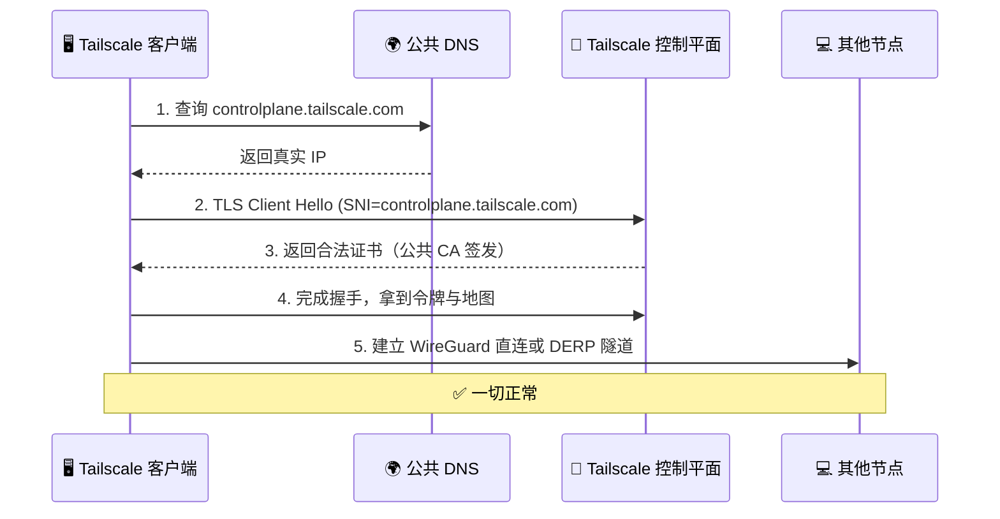
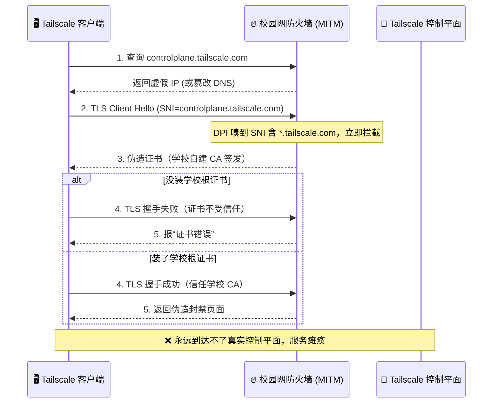
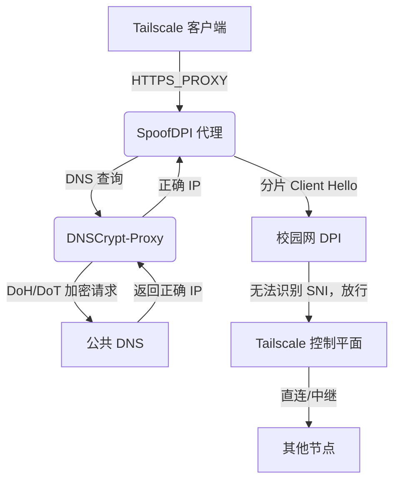

import { Aside, Ruby } from "@/components/content/components";

## 铁幕森森锁域名，中间截道假传书

> 校园网如何精准封锁 Tailscale

校园网出口蹲着一个“网络审查官”——<Ruby rt="深度||包||检测" rb="deep| |packet| |inspection" />（DPI）系统。它不搞小动作，直接上大招：**HTTPS 中间人劫持**。简单说，就是防火墙冒充真正的 [Tailscale](https://tailscale.com/) 服务器，给你递一张假证书，企图冒充李逵，其实全是李鬼。

- **触发条件**：你的客户端发出 TLS Client Hello，里面的 <Ruby rt="服务器||名称||指示" rb="server| |name| |indication" />（SNI）字段明晃晃写着 `tailscale.com`。防火墙一看，“抓到关键词了！”，立刻跳出来截胡。
- **中间人截胡**：它不玩简单粗暴的 RST 断连，而是**动态生成一张学校自建 CA 签名的假证书**，假装自己是 `controlplane.tailscale.com` 来和你握手。这很像某些公共 Wi‑Fi 让你安装根证书才能上网的套路，只不过这次目标是 Tailscale。
- **证书露馅**：因为你电脑里没装学校的“假 CA”，客户端直接弹窗“证书错误”，连接当场掐断。
- **就算装了根证书**：即便你导入了学校的根证书，TLS 握手确实会成功，但你看到的并不是 Tailscale 控制平面，而是防火墙吐出的**封禁告示页面**，上面赫然写着“此网站已被封锁”。本质上，所有 `*.tailscale.com` 的 HTTPS 流量都被劫持到学校的审查服务器，再也见不到真正的地球另一头。

这种封锁比 DNS 污染狠得多：它不仅污染解析，还亲自下场扮演假服务员，让你连不上、也逃不掉。控制平面彻底失联，节点列表刷不出来，Tailscale 整个网络当场瘫痪。

<Aside type="info" title="为什么封禁 *.tailscale.com 就能一剑封喉？">

Tailscale 的架构分“控制平面”和“数据平面”。所有设备要先找控制平面（`controlplane.tailscale.com`）做身份验证、拿密钥、同步节点列表，然后才能建立起设备间的 WireGuard 隧道。也就是说，控制平面就像火车站的调度中心，没有调度中心的指令，火车再快也发不出去。

学校 DPI 正是抓住这个“阿喀琉斯之踵”——只需封掉 `*.tailscale.com`，就把调度中心的大门焊死了。

**正常连线流程**（无封锁）：



**被封锁惨状**（校园网中间人）：



**结论**：无论你信不信学校的假证书，只要 SNI 里带了 `tailscale.com`，防火墙就会出来假扮目标，给你“此路不通”的假页面。Tailscale 客户端永远等不到真正的握手，整套组网就此完蛋。

</Aside>

## 分片巧隐真面目，偷渡阴平过雄关

> 加密 DNS + TLS 分片混淆

既然封锁的根源是 **SNI 暴露了“我是 Tailscale”的身份牌**，我们的解法也很直白：**在 TLS 握手阶段把 SNI 藏起来，让 DPI 认不出这是 Tailscale 流量，自然就不会触发假证书拦截**。顺便，再给 DNS 加个密，防止被恶意投毒。

于是我们搭了一条本地代理链：



**三个核心部分各显神通**：

- **DNS 层**：[DNSCrypt-Proxy](https://www.dnscrypt-proxy.org/) 用 DNS over HTTPS（DoH，[^1]）或 DNS over TLS（DoT，[^2]）只给 SpoofDPI 提供无污染的域名解析。系统其它应用继续用默认 DNS，互不干扰。
- **TLS 混淆层**：[SpoofDPI](https://github.com/bariiss/SpoofDPI) 就像一个“碎纸机”，把 TLS Client Hello 拆成多个小到 DPI 看不懂的 TCP 分片发出去。而 DPI 设备为了性能通常不会重组应用层数据，只会逐段检查，因此防火墙一个分片一个分片地看，根本拼不出完整的 SNI，只能放行。
- **应用层引流**：通过 systemd 覆盖文件，给 `tailscaled` 注入 `HTTPS_PROXY` 环境变量，控制流量乖乖流进 SpoofDPI 的代理端口，全程不用修改 Tailscale 客户端一行代码。

## 双鸾护驾安营寨，锦囊妙手定风波

> 部署步骤

<Aside type="info" title="测试环境">

以下流程在 Arch Linux 和 Ubuntu 24.04 上经过测试可以使用。其它发行版理论上同样适用。

</Aside>

### 第一护法：DNSCrypt-Proxy 辟秽

安装 [DNSCrypt-Proxy](https://github.com/DNSCrypt/dnscrypt-proxy)，让它监听在 `127.0.0.1:5353`（错开系统 `systemd-resolved` 的 53 端口）：

```bash
sudo nano /etc/dnscrypt-proxy/dnscrypt-proxy.toml
```

修改：

```toml
listen_addresses = ['127.0.0.1:5353']
# 如有需要，可加 '[::1]:5353'
# 端口冲突就改成 5354 等其他端口
require_dnssec = true  # 锦上添花，更加安全
```

其余保持默认，启用服务：

```bash
sudo systemctl enable --now dnscrypt-proxy
```

<Aside type="tip" title="若 DNSCrypt-Proxy 没自带 systemd 服务？">

手动创建：

```bash
sudo nano /etc/systemd/system/dnscrypt-proxy.service
```

写入：

```ini
[Unit]
Description=DNSCrypt Proxy
After=network.target

[Service]
ExecStart=/usr/local/bin/dnscrypt-proxy -config /etc/dnscrypt-proxy/dnscrypt-proxy.toml
Restart=on-failure
User=root

[Install]
WantedBy=multi-user.target
```

<Aside type="important" title="注意">

把 `ExecStart` 中路径换成你实际的二进制和配置文件路径。

</Aside>

然后启用：

```bash
sudo systemctl daemon-reload
sudo systemctl enable --now dnscrypt-proxy
```

</Aside>

<Aside type="danger" title="DoH/DoT 也被封怎么办？">

若学校防火墙连常用 DoH（如 Cloudflare、Google）也阻断，可以修改 `dnscrypt-proxy.toml` 的 `server_names`，换用其他支持的加密 DNS 服务器（如 AdGuard、Quad9 等），或通过代理隧道传输 DNS 查询。未做过测试，理论上可行，但配置会更复杂一些。

</Aside>

### 第二护法：SpoofDPI 易容

安装 [SpoofDPI](https://github.com/xvzc/spoofdpi)，并给其添加执行权限。然后创建 systemd 服务：

```bash
sudo nano /etc/systemd/system/spoofdpi.service
```

填入：

```ini
[Unit]
Description=SpoofDPI Proxy
After=network.target dnscrypt-proxy.service
Requires=dnscrypt-proxy.service

[Service]
Type=simple
ExecStart=/usr/local/bin/spoofdpi --no-tui --dns-addr 127.0.0.1:5353
Restart=on-failure
RestartSec=5s
NoNewPrivileges=true
ProtectHome=true
ProtectSystem=strict
PrivateTmp=true
User=root

[Install]
WantedBy=multi-user.target
```

<Aside type="important" title="注意">

- `ExecStart` 路径按实际安装位置修改。
- `--dns-addr` 指向上一步中 DNSCrypt-Proxy 的监听地址端口。
- SpoofDPI 默认监听 `127.0.0.1:8080`，若需改端口，加 `--listen-addr` 参数，如 `--listen-addr 127.0.0.1:8081`，并同步修改稍后 Tailscale 的代理配置。

</Aside>

启用：

```bash
sudo systemctl daemon-reload
sudo systemctl enable --now spoofdpi
```

### 主角就位：Tailscale 遁入代理道

为 `tailscaled` 注入代理环境变量：

```bash
sudo systemctl edit tailscaled
```

添加：

```ini
[Service]
Environment="HTTPS_PROXY=http://127.0.0.1:8080"
```

重载并重启：

```bash
sudo systemctl daemon-reload
sudo systemctl restart tailscaled
```

### 验证效果

```bash
tailscale status
# 所有节点显示 active，health 无报错
```

看 SpoofDPI 日志，确认流量已被代理：

```bash
sudo journalctl -u spoofdpi -f
# 应出现 CONNECT controlplane.tailscale.com:443 等记录
```

搞定！三个服务已纳入 systemd 领兵，开机自启，持久守护。

<Aside type="tip" title="故障排查小抄">

- 若 `tailscale health` 提示 iptables/nftables 错误：
  - 确认 `nftables.service` 正在运行
  - `/usr/bin/iptables` 应指向 `iptables-nft`（现代内核标配）
  - `lsmod | grep nf_tables` 看看内核模块加载了没
  - 实在不行，重启大法好。
- 若代理不通：
  - `sudo systemctl status dnscrypt-proxy` 看状态
  - `dig @127.0.0.1 -p 5353 controlplane.tailscale.com` 测试能否解析出真实 IP
  - `curl -x http://127.0.0.1:8080 -I https://controlplane.tailscale.com 2>&1 | head -20` 若能正常返回 HTTP 头，说明代理链路没问题，不需要启动 tailscaled 就能测试。

</Aside>

## 烽火连营问代价，算清账目自从容

> 那么代价是什么？

布阵之后，最关心的莫过于：网速会不会血崩？我们按三个维度算笔账。

- **控制平面延迟**（登录、同步节点等轻量操作）
  - **微微涨，毫秒级，几乎无感。**
  - 控制流量虽然在本地多了个 SpoofDPI 转发，但全程都在 `127.0.0.1` 内部打转，没有新增网络请求。实测 TLS 握手的额外延迟，比你眨眼还短。
- **数据平面带宽与延迟**（传文件、远程桌面等重活）
  - **零影响，原汁原味。**
  - 本方案只代理控制平面的 HTTPS 流量。真正的文件传输、远程桌面走的是 WireGuard 直连或 DERP 中继，**完全不经过 SpoofDPI 或 DNSCrypt-Proxy**，直接走系统原生网络栈，速度全由校园网本身决定。
- **连接建立速度**（首次连接或断线重连）
  - **微小增长，可忽略。**
  - 多了 DNSCrypt-Proxy 的一次加密 DNS 查询，但通常和学校的默认 DNS 相当。SpoofDPI 常驻后台，冷启动耗时只在毫秒级，日常体验平滑。

**一句话总结**：只要控制平面打通了，后续的传文件、连远程，速度和被封锁前没差。唯一的变化就是——它终于能通了。

<Aside type="caution" title="特殊场景提醒">

如果你的网络环境恶劣到所有数据都走 DERP 中继，那延迟取决于中继服务器的地理位置和网络质量，与本方案无关。

</Aside>

## 金刚不坏身自证，护体神功细检点

> 安全与可用性评估

| 维度           | 评估          | 简评                                                                                        |
| :------------- | :------------ | :------------------------------------------------------------------------------------------ |
| **DNS 安全**   | ✅ 显著提升   | 加密 DoH/DoT 让 DNS 不再裸奔，只供代理链使用，不影响全局。                                  |
| **端到端加密** | ✅ 原封不动   | SpoofDPI 只做分片，不解密；Tailscale 自身的 TLS 与 WireGuard 加密不受影响。                 |
| **中间人风险** | ✅ 无新增     | 代理只监听到 `127.0.0.1`，外头摸不到。                                                      |
| **可用性**     | ✅ 稳如老狗   | systemd 管着三个服务，挂了自动拉起来，重启即恢复。                                          |
| **维护成本**   | ✅ 一劳永逸   | 配一次，适用很久，除非内核或软件大版本翻天。                                                |
| **合规性**     | ⚠️ 自行评估   | 工具只在本地处理流量，使用场景是否符合校规/法规，请自行判断。                               |
| **局限**       | 💡 需基础网络 | 若校园网白名单锁死，啥都没辙；若将来 DPI 能拼合分片，可能需要再加一层自建 DERP 或协议伪装。 |

## 轻舟已过万重山，重生日月续华章

> 总结

面对校园网的 HTTPS 中间人封锁，我们用两个轻量级工具，[DNSCrypt-Proxy](https://www.dnscrypt-proxy.org/) 和 [SpoofDPI](https://github.com/bariiss/SpoofDPI)，给 [Tailscale](https://tailscale.com/) 的控制平面开了一条“暗道”，而且**不影响实际数据传输速度**。

核心思路就十个字：**加密 DNS，分片 SNI**。防火墙连 SNI 的影子都抓不到，自然无法假扮服务员。整套方案只动两纸 systemd 配置，不污染系统全局，堪称“不战而屈人之兵”。

如果你也被学校/公司的 DPI 封锁折磨，不妨照着这个方子抓一剂。让自由的组网，重新上线。

---

相关链接：

[^1]: https://zh.wikipedia.org/wiki/DNS_over_HTTPS

[^2]: https://zh.wikipedia.org/wiki/DNS_over_TLS
